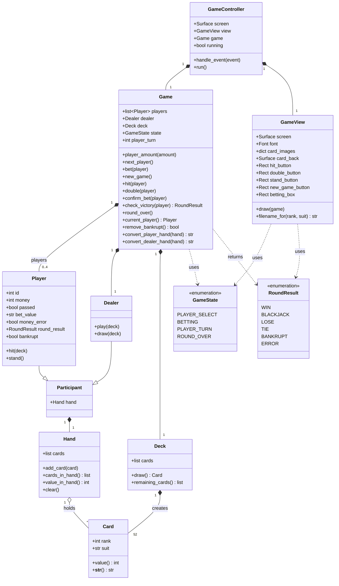

# blackjack
Repository for my Blackjack program project.

This project involved developing a program that allows a user to play a typical game of BlackJack.

The program runs by typing "python -i Control.py" into the console inside the folder containing the files, and testing it with unit tests is done via "python -m coverage run --source=Deck,Participant,Game -m unittest test_blackjack", which tests the model part of the program.

The program uses a classic Model, View, Controller setup, which separates the three assignemnts for a program into separate files and groups of files. The Deck.py, Participant.py and Game.py consists of the Model part of the game, which has all the backend logic and memory of the state of the game. View.py uses the PyGame framework to display the various cards and information used by the player, and Control.py makes calls to both of them to depending on what inputs the user makes.

Noteably, the program is currently missing the "split" feature that would normally belong in a regular game of blackjack, which i might implement later if I find the time.

# Blackjack — Class Diagram

