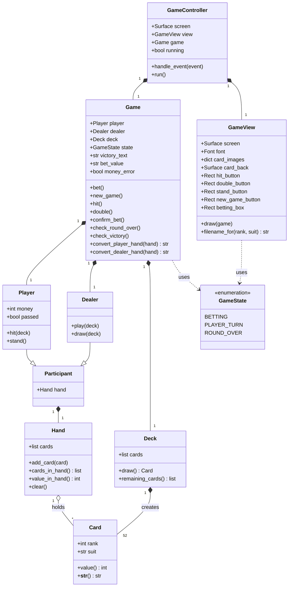

# Blackjack — Class Diagram

```mermaid
classDiagram
    class Card {
        +int rank
        +str suit
        +value() int
        +__str__() str
    }

    class Deck {
        +list cards
        +draw() Card
        +remaining_cards() list
    }

    class Hand {
        +list cards
        +add_card(card)
        +cards_in_hand() list
        +value_in_hand() int
        +clear()
    }

    class Participant {
        +Hand hand
    }

    class Player {
        +int money
        +bool passed
        +hit(deck)
        +stand()
    }

    class Dealer {
        +play(deck)
        +draw(deck)
    }

    class GameState {
        <<enumeration>>
        BETTING
        PLAYER_TURN
        ROUND_OVER
    }

    class Game {
        +Player player
        +Dealer dealer
        +Deck deck
        +GameState state
        +str victory_text
        +str bet_value
        +bool money_error
        +bet()
        +new_game()
        +hit()
        +double()
        +confirm_bet()
        +check_round_over()
        +check_victory()
        +convert_player_hand(hand) str
        +convert_dealer_hand(hand) str
    }

    class GameView {
        +Surface screen
        +Font font
        +dict card_images
        +Surface card_back
        +Rect hit_button
        +Rect double_button
        +Rect stand_button
        +Rect new_game_button
        +Rect betting_box
        +draw(game)
        +filename_for(rank, suit) str
    }

    class GameController {
        +Surface screen
        +GameView view
        +Game game
        +bool running
        +handle_event(event)
        +run()
    }

    Deck "1" *-- "52" Card : creates
    Hand "1" o-- "*" Card : holds
    Participant "1" *-- "1" Hand
    Player --|> Participant
    Dealer --|> Participant
    Game "1" *-- "1" Player
    Game "1" *-- "1" Dealer
    Game "1" *-- "1" Deck
    Game ..> GameState : uses
    GameController "1" *-- "1" Game
    GameController "1" *-- "1" GameView
    GameView ..> GameState : uses
```
